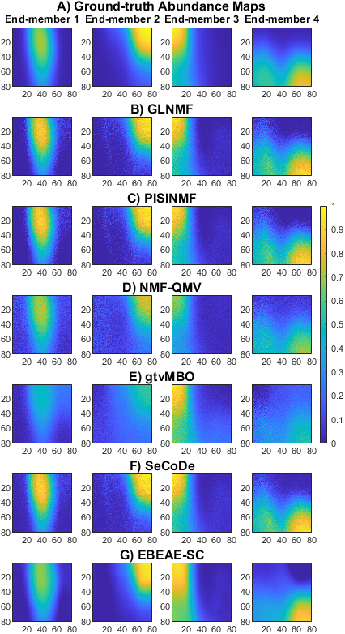
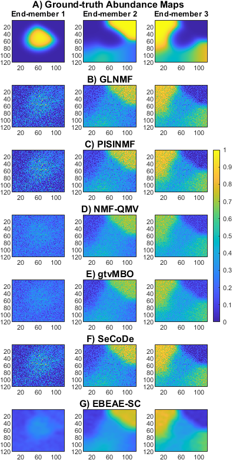
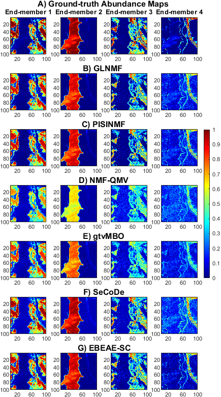
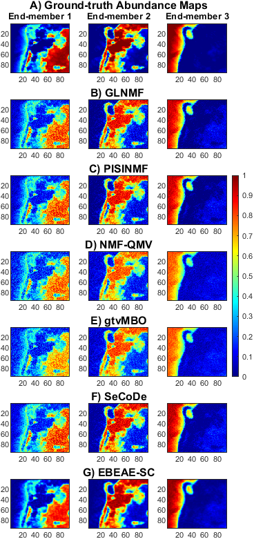

# Extended Blind End-member and Abundance Extraction with Spatial Coherence
Matlab implementation of Multi and Hyperspectral Image Unmixing with Spatial Coherence by Extended Blind End-member and Abundance Extraction algorithm. <br><br>

Blind linear unmixing (BLU) methods allow separating multi and hyperspectral datasets into end-members and abundance maps with an unsupervised perspective. However, due to measurement noise and model uncertainty, the estimated abundance maps could exhibit a high presence of granularity, which causes a loss of detail that might be relevant in certain applications. To address this problem, in this work we present a BLU proposal that considers spatial coherence (SC) in abundance estimates. The proposed BLU formulation is based on the blind end-member and abundance extraction ([EBEAE](https://ieeexplore.ieee.org/stamp/stamp.jsp?tp=&arnumber=8931797) methodology, and is denoted as EBEAE-SC. In this proposed method, internal abundances are added to induce SC in the cost function, which is solved by a coordinate descent algorithm, constrained quadratic optimization, and the [Bregman split](https://link.springer.com/content/pdf/10.1007/s10915-009-9331-z.pdf) formulation. The validation process considers the results with synthetic, real, and experimental datasets to show that the proposed methodology can significantly decrease the granularity in the estimated abundances, without losing detail of the structures present in multi and hyperspectral images. The  EBEAE-SC methodology allows blind estimates of end-members and abundances in the studied databases of various types of applications, producing estimates of linearly independent and non-negative end-members, as well as non-negative abundances, with lower estimation errors and computational times compared to methodologies from the state-of-the-art. <br>

The results are compared to five state-of-the-art BLU methods that consider in their formulation the spatial information of the image to be analyzed: (i) graph-regularized L_1/2 nonnegative matrix factorization ([GLNMF](https://ieeexplore.ieee.org/abstract/document/7892882)), (ii) preserving the intrinsic structure invariant nonnegative matrix factorization ([PISINMF](https://www.mdpi.com/1424-8220/18/10/3528)), (iii) nonnegative matrix factorization-quadratic minimum volume ([NMF-QMV](http://www.lx.it.pt/~bioucas/files/ieee_tgrs_2019_NMF-QMV.pdf)), (iv) graph total variation regularized NMF solved by Merriman-Bence-Osher ([gtvMBO](https://drive.google.com/file/d/1Y3idFAXUmjsPG5pUA-hzc913UgdFMAGd/view)), and (v) sparsity-enhanced convolutional decomposition ([SeCoDe](https://openremotesensing.net/wp-content/uploads/2021/04/2021_IEEE_TGRS_unmixing_tensor.pdf)).<br>


The file "test_mFLIM.m" evaluates the unmixing of one realization of the Monte Carlo estimation results (abundance maps) for m-FLIM synthetic datasets (N=4, SNR=12.5 dB and PSNR=12.5 dB): A) Ground-truth, B) GLNMF, C) PISINMF, D) NMF-QMV, E) gtvMBO, F) SeCoDe, and G) EBEAE-SC. <br>

<p align="center">
 <br>
</p>
The file "test_VNIR.m" evaluates the unmixing of one realization of the Monte Carlo estimation results (abundance maps) for VNIR-HSI synthetic datasets (N=3, SNR=12.5 dB and PSNR=12.5 dB): A) Ground-truth, B) GLNMF, C) PISINMF, D) NMF-QMV, E) gtvMBO, F) SeCoDe, and G) EBEAE-SC.<br>

<p align="center">
 <br>
</p>

The file "test_Jasper.m" evaluates the unmixing of one realization of the Monte Carlo estimation results (abundance maps) for Jasper Ridge HSI (N=4, SNR=12.5 dB and PSNR=12.5 dB): A) Ground-truth, B) GLNMF, C) PISINMF, D) NMF-QMV, E) gtvMBO, F) SeCoDe, and G) and E) EBEAE-SC. <br>

<p align="center">
 <br>
</p>
 The file "test_Jasper.m" evaluates the unmixing of one realization of the Monte Carlo estimation results (abundance maps) for Samson HSI (N=3, SNR=12.5 dB and PSNR=12.5 dB): A) Ground-truth, B) GLNMF, C) PISINMF, D) NMF-QMV, E) gtvMBO, F) SeCoDe, and G) and E) EBEAE-SC. <br>

<p align="center">
 <br>
</p><br><br>
  
 

## Citation
If you use this code or ideas from our paper, please cite our paper:<br> <br>
 | [Previous work](https://ieeexplore.ieee.org/document/9629708)  <br>
 * Extended Blind End-member and Abundance Estimation with Spatial Total Variation for Hyperspectral Imaging<br>
 [Inés A. Cruz-Guerrero](https://orcid.org/0000-0001-8034-8530)<sup>1</sup>,
 [Daniel U. Campos-Delgado](https://orcid.org/0000-0002-1555-0131)<sup>1,2</sup>,
 [Aldo R. Mejía-Rodríguez](https://orcid.org/0000-0003-0704-0681)<sup>2</sup> <br>
<sup>1</sup>Faculty of Science, Autonomous University of San Luis Potosí, Av. Parque Chapultepec 1570, 78290, S.L.P., Mexico<br>
<sup>2</sup>Optical Communication Research Institute (IICO), Autonomous University of San Luis Potosí, Av. Karakorum 1470, 78210, S.L.P., México<br>

```
@INPROCEEDINGS{9629708,
  author={Cruz-Guerrero, Inés A. and Campos-Delgado, Daniel U. and Mejía-Rodríguez, Aldo R.},
  booktitle={2021 43rd Annual International Conference of the IEEE Engineering in Medicine Biology Society (EMBC)}, 
  title={Extended Blind End-member and Abundance Estimation with Spatial Total Variation for Hyperspectral Imaging}, 
  year={2021},
  volume={},
  number={},
  pages={1957-1960},
  doi={10.1109/EMBC46164.2021.9629708}}
```
| [Extensive work](https://www.sciencedirect.com/science/article/abs/pii/S0016003223005136) <br>
* Multi and Hyperspectral Image Unmixing with Spatial Coherence by Extended Blind End-member and Abundance Extraction <br>
 [Inés A. Cruz-Guerrero](https://orcid.org/0000-0001-8034-8530)<sup>1</sup>,
 [Daniel U. Campos-Delgado](https://orcid.org/0000-0002-1555-0131)<sup>1,2</sup>,
 [Aldo R. Mejía-Rodríguez](https://orcid.org/0000-0003-0704-0681)<sup>2</sup>
 [Samuel Ortega](https://orcid.org/0000-0002-7519-954X)<sup>3,4</sup>,
 [Himar Fabelo](https://orcid.org/0000-0002-9794-490X)<sup>4</sup>,
 [Javier A. Jo.](https://orcid.org/0000-0001-6368-2246)<sup>5</sup>,
 [Gustavo M. Callico](https://orcid.org/0000-0002-3784-5504)<sup>4</sup> <br>
<sup>1</sup>Faculty of Science, Autonomous University of San Luis Potosí, Av. Parque Chapultepec 1570, 78290, S.L.P., Mexico<br>
<sup>2</sup>Optical Communication Research Institute (IICO), Autonomous University of San Luis Potosí, Av. Karakorum 1470, 78210, S.L.P., México<br>
<sup>3</sup>Norwegian Institute of Food Fisheries and Aquaculture Research (NOFIMA), 9019 Tromsø, Norway<br>
<sup>4</sup>Institute for Applied Microelectronics (IUMA), University of Las Palmas de Gran Canaria, E35017 Las Palmas de Gran Canaria, Spain<br>
Submitted to Signal Processing (Elsevier),<br>
<sup>5</sup>School of Electrical and Computer Engineering, University of Oklahoma, Norman, Oklahoma, United States of America.<br>

```
@article{CRUZGUERRERO2023,
title = {Multi and Hyperspectral Image Unmixing with Spatial Coherence by Extended Blind End-member and Abundance Extraction},
journal = {Journal of the Franklin Institute},
year = {2023},
issn = {0016-0032},
doi = {https://doi.org/10.1016/j.jfranklin.2023.08.027},
url = {https://www.sciencedirect.com/science/article/pii/S0016003223005136},
author = {Inés A. Cruz-Guerrero and Aldo R. Mejıa-Rodrıguez and Samuel Ortega and Himar Fabelo and Gustavo Callico and Javier A. Jo and Daniel U. Campos-Delgado},
keywords = {Blind linear unmixing, hyperspectral imaging, split Bregman, total variation},
abstract = {Blind linear unmixing (BLU) methods decompose multi and hyperspectral datasets into end-members and abundance maps with an unsupervised perspective. However, due to measurement noise and model uncertainty, the estimated abundance maps could exhibit granularity, which causes a loss of detail that could be crucial in certain applications. To address this problem, in this paper, we present a BLU proposal that considers spatial coherence (SC) in the abundance estimates. The proposed BLU formulation is based on the extended blind end-member and abundance extraction (EBEAE) methodology, and is denoted as EBEAE-SC. In this proposed method, the energy functional of EBEAE-SC includes new variables, which are denoted as internal abundances, to induce SC in the BLU approach. The new formulation of the optimization problem is solved by a coordinate descent algorithm, constrained quadratic optimization, and the split Bregman formulation. We present a comprehensive validation process that considers synthetic and experimental datasets at different noise types and levels, and a comparison with five state-of-the-art BLU methods. In our results, EBEAE-SC can significantly decrease the granularity in the estimated abundances, without losing detail of the structures present in the multi and hyperspectral images. In addition, the resulting complexity of EBEAE-SC is analyzed and compared it to the original formulation of EBEAE, and also the numerical convergence of the resulting iterative process is evaluated. Hence, by our analysis, EBEAE-SC allows blind estimates of end-members and abundances in the studied datasets of diverse applications, producing linearly independent and non-negative end-members, as well as non-negative abundances, with lower estimation errors and computational times compared to five methodologies in the state-of-the-art.}
}
```

